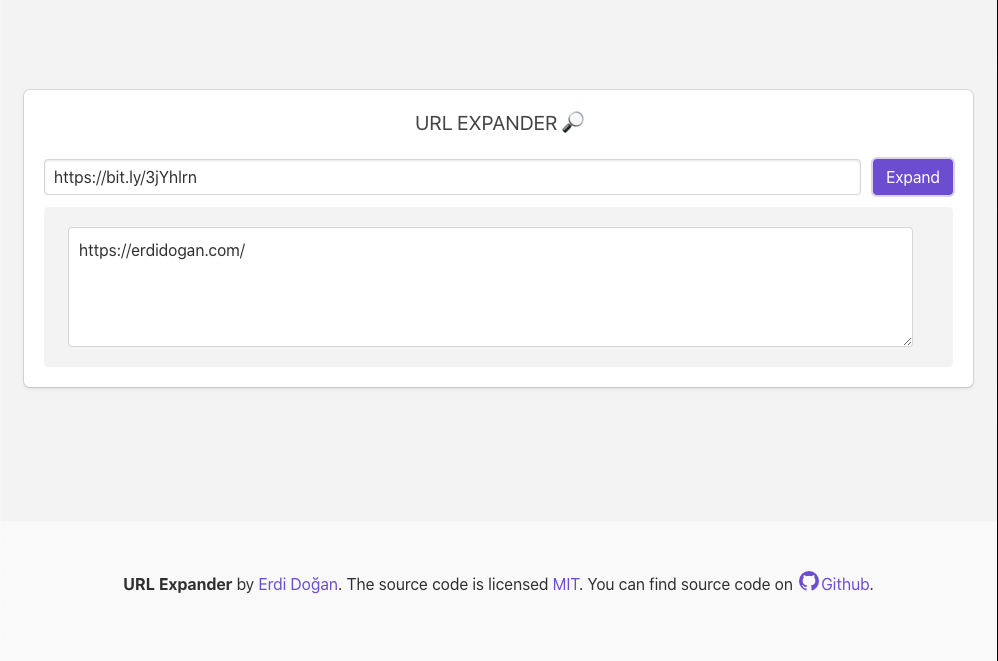

# URL-Expander-Web


This application has a REST API. You can view the link below:

[URL-Expander-API](https://github.com/erdidogan/URL-Expander-API#url-expander-api)

URL Expander is a webapp which; expands short url. 



## Features
* Vue JS App
* Elegant, Simple UI


### Prerequisites
 
```
NodeJS
```

### Installing

Download NodeJS for installation process.

To install this repo you need to install and configure REST API. Please checkout the link below:

[URL-Expander-API](https://github.com/erdidogan/URL-Expander-API#url-expander-api)

- Go to web folder and execute install command ( Vue Js App | Port: 8080)
```
npm install
```


### Start Program

- Execute:
```
npm run serve
```

## Authors

 [Erdi Doğan](https://www.linkedin.com/in/doganerdi) 


## License

This project is licensed under the MIT License 


